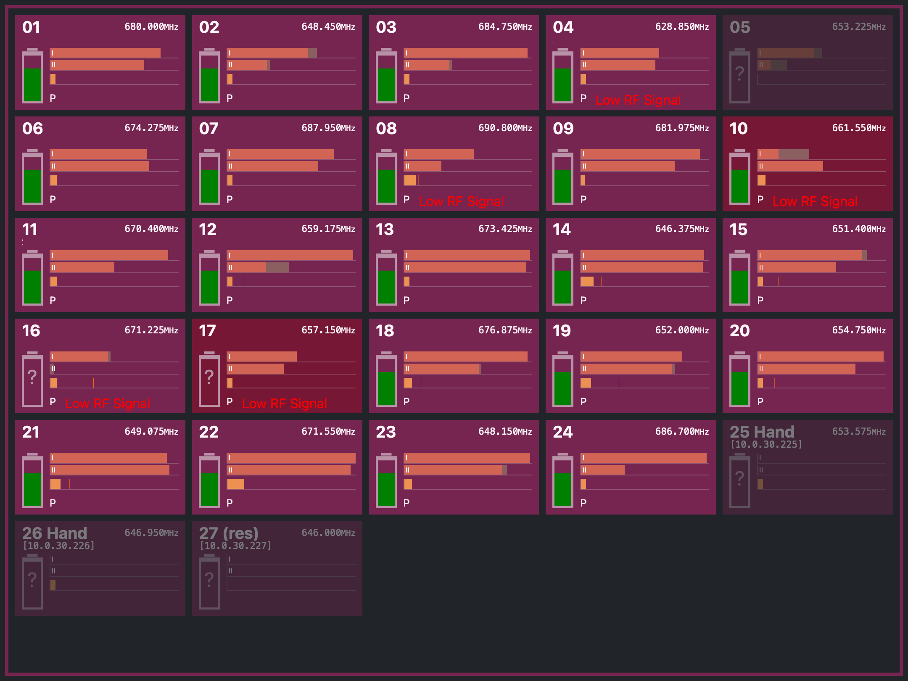

# RFjs - Wireless Microphone Status Monitor 

This project implements a client-server architecture for providing status monitoring of wireless microphones that support the *Sennheiser Media Control Protocol* (MCP) via UDP port 53212, as described in Sennheiser documents *[Media control protocol description](https://assets.sennheiser.com/global-downloads/file/12379/ewG3_2000_MediaControlProtocolDescription_120122.pdf)* and *[TI 1254 v1.0](https://assets.sennheiser.com/global-downloads/file/12478/TI_1254_MetroMediensteuerung_ewG4_EN.pdf)*.  
It was tested using 2000 series, EM300 G3, EM500 G3 and EM300-500 G4 receivers.

## Quickstart
The [rfjs_server.js](rfjs_server.js) file provides all server-side components, including transmission of periodic status requests, handling the receiver's responses, receiving annotation texts and providing the web server.

The quickest way to run it is to execute:
```
chmod +x rfjs_server.js
./rfjs_server.js
```

Beware that the web interface by default tries to bind to port 80. 
On many *nix systems, non-privileged (i.e. non-root) users are not allowed to bind to the *well-known ports* 1...1023. 
As a solution, you can either:
* move the web interface to a different port >1023 (e.g. 8080) using the ```httpServerPort``` variable in [rfjs_server.js](rfjs_server.js)
* allow the ```node``` executable to bind to these ports: ```sudo setcap 'cap_net_bind_service=+ep' /usr/bin/node``` (must be repeated after updates)
* lower the boundary of unprivileged ports down to 80: ```sudo sysctl net.ipv4.ip_unprivileged_port_start=80```
* execute the software as root (**not** recommended)

Once the server is running, navigate to ```http://<address>```, and you should see the web view. 
If the server is running and the web interface can not be reached, check your firewall rules to allow incoming requests for the desired port (80 by default).

## Installation
For a more permanent installation, Node.js process managers such as ```pm2``` can be used to invoke the script at startup and restart it if errors occur.

## Layout
By default, the web view supports two different styles for portrait and landscape orientation, with some additional cases:
* In **landscape** mode, five channels are displayed per row, showing 30 channels without scrolling for an aspect ratio of 4:3.
* In **portrait** mode, the layout is quite different and only shows two channels per row. This creates a "virtual rack" layout, resembling the familiar look of rack-mounted dual channel receivers in a dark color scheme, suitable for FoH use. A single WQHD (1920x1200) monitor rotated by 90° can display at least 30 channels.
* A special set of layouts is activated, if the screen reports a maximum width of 765px (e.g. most smartphones). For these devices, the layout shows two channels per row in portrait and three channels per row in landscape mode.



## Configuration
The server needs to know to which address or interface it should bind its listening interfaces to.
By default, the web server does not bind to a specific interface and is listening on ```80/TCP``` of all available interfaces.  

In contrast, the MCP and annotation UDP servers try to bind to a specific interface.
The ```findSuitableNetworkAddressForUDP()``` method iterates all interfaces while skipping local and IPv6 ones, and tries to find a matching interface. 
This function most probably should be adjusted to meet your individual requirements.  
If no matching interface was found, the server tries to bind to ports ```53210/UDP``` (annotation) and ```53212/UDP``` (MCP) on all available interfaces.

## Browser compatibility
The project should work on all major current browsers.
In addition, the web view scripting is limited to ES5 JavaScript style.
It is designed to be working down to iOS9, so everything from an iPad2 onwards should be compatible.

If the web view page is stored to an iOS device's home screen, it becomes a fullscreen web app.

## Naming / Annotating devices
This is useful if you want to annotate your channels, for example by adding an actor or role name to the view.
The naming can be done by sending plain text via UDP, for example from within a QLab *Network* cue.

Each received name string is kept as long as the server is running, irrespective of whether that specific receiver is already known.
Therefore, the comments can be set even before all receivers are connected.

Technically, the server listens for UDP messages on port ```53210``` containing a JSON map data structure for naming individual channels. 
Each individual receiver is identified by its IPv4 address, so the expected data structure could be something like this:
```
[
  ["10.10.10.1","Mic 1"],
  ["10.10.10.2","Mic 2"]
]
```

---
## Disclaimer
This project is in no way affiliated with Sennheiser or QLab. Mentioning both of them is just a description of the environment for which this project was developed.    

Sennheiser, the Media Control Protocol, and the listed product names are property of Sennheiser electronic GmbH & Co. KG and are only used for reference to the devices and publicly available protocol information. 

QLab is property of Figure 53, LLC.

---
Have fun to use and modify this code, but remember that everything is at your own risk. 
